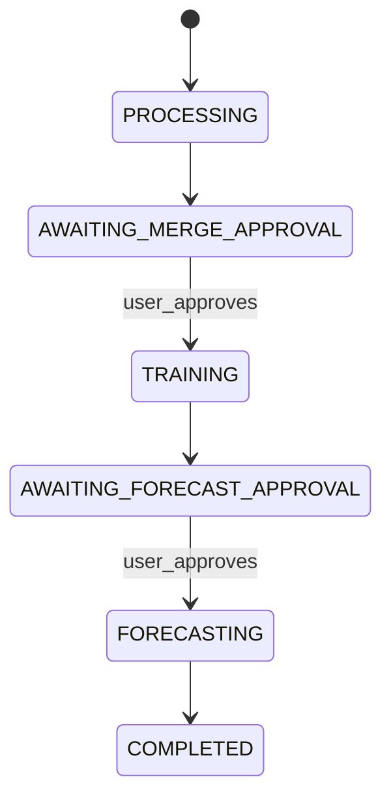

# Cloudy with a Chance of Revenue

Lead magnet web app: upload time series CSV, merge Open-Meteo weather covariates,
approve training, review feature importance, then run a forecast.

## Architecture

Three stages with human-in-the-loop approvals:

1. **Preprocess** — Lambda validates CSV, merges weather, writes S3 + DynamoDB
2. **Train** — User approves → SageMaker + AutoGluon (`fast_training` preset later)
3. **Forecast** — User approves after reviewing importance → inference Lambda



## Quick start (local)

```bash
uv sync --extra api --extra frontend --extra dev
./scripts/run_local_api.sh      # terminal 1
./scripts/run_streamlit.sh      # terminal 2
```

Set `CLOUDY_API_URL` to your deployed API Gateway URL when not running locally.

## Repo layout

```
app/          domain, services, lambdas, api, frontend
ml/           SageMaker training + Lambda inference
infra/cdk/    AWS CDK stacks
scripts/      local run + deploy helpers
```

## Deploy AWS

```bash
./scripts/deploy_infra.sh
./scripts/deploy_sagemaker_container.sh
```

## Environment variables

| Variable | Purpose |
|----------|---------|
| `DATA_BUCKET_NAME` | S3 bucket for raw/merged/models |
| `JOBS_TABLE_NAME` | DynamoDB jobs table |
| `SAGEMAKER_ROLE_ARN` | Role for training jobs |
| `TRAINING_IMAGE_URI` | ECR image for SageMaker |
| `CLOUDY_API_URL` | Streamlit → API base URL |
